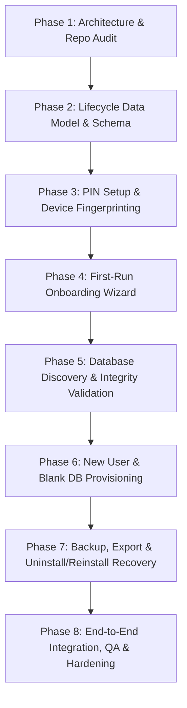

# Diamond ERP V3.0 — First-Run & Lifecycle Implementation Plan (Phases 2–8)

> **Phase 1 Audit Artifact**  
> **Repository:** `https://github.com/StavanSheth/Diamond_ERP`  
> **Branch:** `v3`  
> **Status:** Authoritative Master Plan for Phases 2–8  
> **Rule:** Planning & Audit Artifact Only (No feature implementation code in Phase 1)

---

## 1. Mandatory Data Safety Invariants

Every future phase MUST strictly comply with these 13 invariants. Any proposed code change that violates these invariants is considered a critical security and integrity regression:

1. **INVARIANT 1 (User-Database Isolation):** Creating a new user creates a completely new, blank SQLite database provisioned from the verified template.
2. **INVARIANT 2 (Zero Inheritance):** A newly created user must never inherit or automatically connect to another user's database file.
3. **INVARIANT 3 (Explicit Discovery Only):** An existing database file must never be attached automatically simply because its filename matches a pattern or looks relevant.
4. **INVARIANT 4 (Pre-Attachment Validation):** Every SQLite database file must undergo cryptographic header validation, schema parity check, and `PRAGMA integrity_check` before it can be attached.
5. **INVARIANT 5 (User Consent for Attachment):** Database attachment requires explicit, affirmative user confirmation in the user interface.
6. **INVARIANT 6 (Non-Destructive User Deletion):** Deleting a user or changing a profile name **MUST NEVER delete the underlying SQLite database file** on disk.
7. **INVARIANT 7 (Uninstall Data Preservation):** Uninstallation must preserve or back up all user data located under `%LOCALAPPDATA%\DiamondERP`.
8. **INVARIANT 8 (Pre-Uninstall Backup Verification):** If a destructive uninstall or reset is requested, a full database backup must be created and verified before any deletion proceeds.
9. **INVARIANT 9 (Native Recoverability):** All SQLite database files must remain standard, unencrypted, and fully recoverable using standard SQLite tools (`sqlite3.exe`).
10. **INVARIANT 10 (Restart Resilience):** First-run configuration, activation, and onboarding states must survive application restarts and system reboots.
11. **INVARIANT 11 (No Plaintext PINs):** User PINs must never be stored in plaintext. PINs must be hashed using salted `bcryptjs` with work factor >= 10.
12. **INVARIANT 12 (Log/Export Sanitization):** PINs, passwords, and encryption keys must never appear in application logs, error messages, or exported files.
13. **INVARIANT 13 (Zero Business Logic Regression):** All existing ERP modules (Stock, Ledger, Parties, Repairs, Certificates, Transactions, Reports) must remain 100% backward compatible and unchanged.

---

## 2. Phase Dependency Graph & Prerequisites

### Exact Prerequisites Matrix:

- **Phase 2 Requires:**
  - Audit baseline from Phase 1.
  - Schema extension in [`schema.prisma`](file:///c:/Projects/ERP%20-%20Copy/Test/TestV3.0/apps/api/prisma/schema.prisma) (`Installation`, `Device`, `UserDatabase`, PIN hash fields).
  - Synchronized `apps/api/prisma/template.db`.
- **Phase 3 Requires:**
  - Phase 2 data models.
  - Hardware fingerprinting service (`apps/api/src/modules/system/device.service.ts`).
  - Salted PIN hashing routines in [`apps/api/src/modules/auth/auth.service.ts`](file:///c:/Projects/ERP%20-%20Copy/Test/TestV3.0/apps/api/src/modules/auth/auth.service.ts).
- **Phase 4 Requires:**
  - Phase 3 authentication endpoints.
  - React UI Onboarding Wizard (`apps/web/src/components/onboarding/OnboardingWizard.tsx`).
  - Routing integration in [`apps/web/src/App.tsx`](file:///c:/Projects/ERP%20-%20Copy/Test/TestV3.0/apps/web/src/App.tsx).
- **Phase 5 Requires:**
  - Phase 4 UI hooks.
  - SQLite validator service (`apps/api/src/modules/system/database-validation.service.ts`).
  - PRAGMA checks and schema version verification.
- **Phase 6 Requires:**
  - Phase 5 validation logic.
  - Decoupled `prisma.ts` dynamic client registry.
  - Clean `template.db` cloning without hardcoded profile dependencies.
- **Phase 7 Requires:**
  - Phase 6 multi-database capabilities.
  - SQLite WAL checkpointing and `VACUUM INTO` backup service in [`settings.controller.ts`](file:///c:/Projects/ERP%20-%20Copy/Test/TestV3.0/apps/api/src/modules/settings/settings.controller.ts).
  - Installer pre-uninstall hook integration in [`installer/Installer.cs`](file:///c:/Projects/ERP%20-%20Copy/Test/TestV3.0/installer/Installer.cs).
- **Phase 8 Requires:**
  - Phases 2–7 complete.
  - Packaging pipeline execution in `scripts/package-windows-release.js`.
  - Comprehensive behavioral testing via `scripts/test-phase8-webview2.js` and `scripts/test-phase9-installer.js`.

---

## 3. Detailed Phase Specifications (Phases 2–8)

### Phase 2: Lifecycle Data Model & Schema

- **Objective:** Extend Prisma schema to support local device identities, installation tracking, PIN credentials, and user-to-database ownership metadata.
- **Files to Inspect:**
  - [`apps/api/prisma/schema.prisma`](file:///c:/Projects/ERP%20-%20Copy/Test/TestV3.0/apps/api/prisma/schema.prisma)
  - [`apps/api/src/infrastructure/database/prisma.ts`](file:///c:/Projects/ERP%20-%20Copy/Test/TestV3.0/apps/api/src/infrastructure/database/prisma.ts)
  - [`scripts/sync-template-db.js`](file:///c:/Projects/ERP%20-%20Copy/Test/TestV3.0/scripts/sync-template-db.js)
- **Files to Modify:**
  - [`apps/api/prisma/schema.prisma`](file:///c:/Projects/ERP%20-%20Copy/Test/TestV3.0/apps/api/prisma/schema.prisma): Add `pinHash` to `User`; add `Device`, `Installation`, and `UserDatabase` models.
  - [`packages/contracts/src/index.ts`](file:///c:/Projects/ERP%20-%20Copy/Test/TestV3.0/packages/contracts): Add TypeScript interfaces for new models.
- **Files to Create:** None.
- **Database Changes:**
  - New tables: `Installation`, `Device`, `UserDatabase`.
  - Updated table: `User` (adds `pinHash: String?`).
  - Regenerate `apps/api/prisma/template.db` containing updated schema with zero records.
- **API Changes:** None in Phase 2.
- **Frontend Changes:** None.
- **Installer Changes:** None.
- **Tests:**
  - `npm run typecheck`
  - Vitest schema migration and model parity unit tests in `apps/api/src/tests/schema.test.ts`.
- **Acceptance Criteria:**
  - Schema compiles cleanly via `prisma generate`.
  - Existing business tests continue to pass with 0 regressions.
  - `template.db` matches schema 100%.
- **Risks:** Breaking existing Stavan.db or test fixtures.
- **Rollback Strategy:** Revert `schema.prisma` git diff and regenerate client.

---

### Phase 3: PIN Setup & Device Fingerprinting

- **Objective:** Implement secure hardware fingerprint generation and salted PIN authentication routines.
- **Files to Inspect:**
  - [`apps/api/src/modules/auth/auth.service.ts`](file:///c:/Projects/ERP%20-%20Copy/Test/TestV3.0/apps/api/src/modules/auth/auth.service.ts)
  - [`apps/api/src/modules/auth/auth.controller.ts`](file:///c:/Projects/ERP%20-%20Copy/Test/TestV3.0/apps/api/src/modules/auth/auth.controller.ts)
  - [`apps/api/src/middleware/auth.ts`](file:///c:/Projects/ERP%20-%20Copy/Test/TestV3.0/apps/api/src/middleware/auth.ts)
- **Files to Modify:**
  - [`apps/api/src/modules/auth/auth.service.ts`](file:///c:/Projects/ERP%20-%20Copy/Test/TestV3.0/apps/api/src/modules/auth/auth.service.ts): Add `setupPin(userId, pin)`, `verifyPin(userId, pin)`.
  - [`apps/api/src/modules/auth/auth.controller.ts`](file:///c:/Projects/ERP%20-%20Copy/Test/TestV3.0/apps/api/src/modules/auth/auth.controller.ts): Add PIN login and setup handlers.
  - [`apps/api/src/modules/auth/auth.routes.ts`](file:///c:/Projects/ERP%20-%20Copy/Test/TestV3.0/apps/api/src/modules/auth/auth.routes.ts): Mount `POST /api/auth/pin-login` with rate limiting.
- **Files to Create:**
  - `apps/api/src/modules/system/device.service.ts`: Computes deterministic machine hash (BIOS UUID / Motherboard serial + CPU ID via standard Windows WMI/Registry).
- **Database Changes:** None (models created in Phase 2).
- **API Changes:**
  - `POST /api/auth/setup-pin` (Protected)
  - `POST /api/auth/pin-login` (Rate limited: max 5 attempts per 15 min)
  - `GET /api/system/device-info`
- **Frontend Changes:**
  - Update [`apps/web/src/services/api/client.ts`](file:///c:/Projects/ERP%20-%20Copy/Test/TestV3.0/apps/web/src/services/api/client.ts) with `setupPin` and `pinLogin` methods.
- **Installer Changes:** None.
- **Tests:**
  - Unit tests for PIN hashing, rate-limiting lockout, and device fingerprint consistency.
- **Acceptance Criteria:**
  - PIN verified via bcrypt.
  - Failed attempts trigger lockout.
  - PIN never appears in console or file logs (Invariant 11 & 12).
- **Risks:** Device fingerprint instability if network adapters change (mitigate by using Motherboard GUID + Windows MachineGuid).
- **Rollback Strategy:** Disable PIN routes in `auth.routes.ts`.

---

### Phase 4: First-Run Onboarding Wizard

- **Objective:** Create the desktop onboarding wizard to guide users through initial setup, device registration, and mode selection.
- **Files to Inspect:**
  - [`apps/web/src/App.tsx`](file:///c:/Projects/ERP%20-%20Copy/Test/TestV3.0/apps/web/src/App.tsx)
  - [`apps/web/src/components/security/FirstRunActivationOverlay.tsx`](file:///c:/Projects/ERP%20-%20Copy/Test/TestV3.0/apps/web/src/components/security/FirstRunActivationOverlay.tsx)
  - [`apps/web/src/contexts/AuthContext.tsx`](file:///c:/Projects/ERP%20-%20Copy/Test/TestV3.0/apps/web/src/contexts/AuthContext.tsx)
- **Files to Modify:**
  - [`apps/web/src/App.tsx`](file:///c:/Projects/ERP%20-%20Copy/Test/TestV3.0/apps/web/src/App.tsx): Check onboarding status; conditionally render `<OnboardingWizard />` if unconfigured.
  - [`apps/web/src/contexts/AuthContext.tsx`](file:///c:/Projects/ERP%20-%20Copy/Test/TestV3.0/apps/web/src/contexts/AuthContext.tsx): Remove hardcoded `stavan` fallback; reflect true state.
- **Files to Create:**
  - `apps/web/src/components/onboarding/OnboardingWizard.tsx`: Multi-step container (Steps: Welcome -> Device Binding -> PIN Creation -> Existing DB Check / Mode Selection).
  - `apps/web/src/components/onboarding/steps/DeviceSetupStep.tsx`
  - `apps/web/src/components/onboarding/steps/PinSetupStep.tsx`
  - `apps/web/src/components/onboarding/steps/DatabaseSelectionStep.tsx`
- **Database Changes:** None.
- **API Changes:**
  - `GET /api/system/onboarding-status`: Returns `{ isActivated, isInitialized, userCount, dbCount }`.
- **Frontend Changes:**
  - Liquid-glass styled interactive wizard matching existing aesthetic.
- **Installer Changes:** None.
- **Tests:**
  - React component unit tests (testing step progression, validation errors, and completion callbacks).
- **Acceptance Criteria:**
  - Wizard appears only on uninitialized installations.
  - Survives browser refresh (Invariant 10).
- **Risks:** Blocking existing users if detection is flawed.
- **Rollback Strategy:** Feature flag `ENABLE_ONBOARDING_WIZARD=false`.

---

### Phase 5: Database Discovery & Integrity Validation

- **Objective:** Scan `%LOCALAPPDATA%\DiamondERP\databases` for existing SQLite databases and validate their integrity and schema compatibility before allowing attachment.
- **Files to Inspect:**
  - [`apps/api/src/infrastructure/paths.ts`](file:///c:/Projects/ERP%20-%20Copy/Test/TestV3.0/apps/api/src/infrastructure/paths.ts)
  - [`apps/api/src/infrastructure/database/prisma.ts`](file:///c:/Projects/ERP%20-%20Copy/Test/TestV3.0/apps/api/src/infrastructure/database/prisma.ts)
- **Files to Modify:**
  - [`apps/api/src/modules/system/system.routes.ts`](file:///c:/Projects/ERP%20-%20Copy/Test/TestV3.0/apps/api/src/modules/system/system.routes.ts): Register discovery and validation endpoints.
- **Files to Create:**
  - `apps/api/src/modules/system/database-validation.service.ts`:
    - `discoverDatabases()`: Lists candidate `.db` files.
    - `validateDatabaseFile(filename)`: Executes SQLite `PRAGMA integrity_check;`, `PRAGMA quick_check;`, verifies required ERP tables, and computes cryptographic hash.
- **Database Changes:** None.
- **API Changes:**
  - `GET /api/system/databases/discover`
  - `POST /api/system/databases/validate`
  - `POST /api/system/databases/attach` (Requires explicit user confirmation - Invariant 5)
- **Frontend Changes:**
  - Discovery list UI inside Onboarding Wizard showing filename, size, last modified date, and validation status badge.
- **Installer Changes:** None.
- **Tests:**
  - Test valid database attachment.
  - Test corrupted database rejection (invalid header, missing tables).
  - Test path traversal injection rejection (e.g. `../../secret.db`).
- **Acceptance Criteria:**
  - Invariants 3, 4, and 5 strictly enforced.
- **Risks:** Large database taking too long to run `integrity_check` (mitigate via `PRAGMA quick_check` for fast initial probe).
- **Rollback Strategy:** Disable `/discover` endpoint.

---

### Phase 6: New User & Blank DB Provisioning

- **Objective:** Enable new user creation with a completely clean, isolated SQLite database cloned from `template.db`.
- **Files to Inspect:**
  - [`apps/api/src/infrastructure/database/prisma.ts`](file:///c:/Projects/ERP%20-%20Copy/Test/TestV3.0/apps/api/src/infrastructure/database/prisma.ts)
  - [`apps/api/src/modules/auth/auth.service.ts`](file:///c:/Projects/ERP%20-%20Copy/Test/TestV3.0/apps/api/src/modules/auth/auth.service.ts)
- **Files to Modify:**
  - [`apps/api/src/infrastructure/database/prisma.ts`](file:///c:/Projects/ERP%20-%20Copy/Test/TestV3.0/apps/api/src/infrastructure/database/prisma.ts): Remove hardcoded `'Stavan'` fallback; support pure dynamic profile codes.
  - [`apps/api/src/modules/auth/auth.service.ts`](file:///c:/Projects/ERP%20-%20Copy/Test/TestV3.0/apps/api/src/modules/auth/auth.service.ts): Update `createUser` to support atomic database provisioning.
- **Files to Create:**
  - `apps/api/src/modules/system/provisioning.service.ts`: Handles atomic copying of `template.db`, schema verification, initial Sequence table seeding, and registering ownership in `UserDatabase`.
- **Database Changes:** None.
- **API Changes:**
  - `POST /api/system/provision-user-database`: Accepts `{ username, displayName, pin, databaseName }`.
- **Frontend Changes:**
  - Form in Onboarding Wizard for user creation and database naming.
- **Installer Changes:** None.
- **Tests:**
  - Verify that newly created database contains zero stock or ledger records (Invariant 1 & 2).
  - Verify that deleting the user does not delete the database file (Invariant 6).
- **Acceptance Criteria:**
  - Invariants 1, 2, and 6 strictly enforced.
- **Risks:** Name collisions in database files (mitigate via sanitized lowercase slug + uniqueness validation).
- **Rollback Strategy:** Revert `provisioning.service.ts`.

---

### Phase 7: Backup, Export & Uninstall/Reinstall Recovery

- **Objective:** Implement comprehensive backup and export capabilities; integrate pre-uninstall backup verification; guarantee complete reinstall recovery.
- **Files to Inspect:**
  - [`installer/Installer.cs`](file:///c:/Projects/ERP%20-%20Copy/Test/TestV3.0/installer/Installer.cs)
  - [`apps/api/src/modules/settings/settings.controller.ts`](file:///c:/Projects/ERP%20-%20Copy/Test/TestV3.0/apps/api/src/modules/settings/settings.controller.ts)
  - [`apps/api/src/modules/reports/reports.service.ts`](file:///c:/Projects/ERP%20-%20Copy/Test/TestV3.0/apps/api/src/modules/reports/reports.service.ts)
- **Files to Modify:**
  - [`apps/api/src/modules/settings/settings.controller.ts`](file:///c:/Projects/ERP%20-%20Copy/Test/TestV3.0/apps/api/src/modules/settings/settings.controller.ts): Extend backup to support all discovered tenant databases, not just active profile.
  - [`installer/Installer.cs`](file:///c:/Projects/ERP%20-%20Copy/Test/TestV3.0/installer/Installer.cs): Add pre-uninstall automated backup trigger before removing binaries (Invariants 7 & 8).
- **Files to Create:**
  - `apps/api/src/modules/settings/export.service.ts`: Generates full archive ZIP containing all databases, certificate PDFs, and CSV/Excel ledger summaries.
- **Database Changes:** None.
- **API Changes:**
  - `POST /api/settings/backup-all`
  - `GET /api/settings/export-package`
- **Frontend Changes:**
  - Enhanced Backup & Export panel in [`SettingsPage.tsx`](file:///c:/Projects/ERP%20-%20Copy/Test/TestV3.0/apps/web/src/pages/SettingsPage.tsx).
- **Installer Changes:**
  - In `PerformUninstall()`, invoke `PRAGMA wal_checkpoint(TRUNCATE)` on all `.db` files before completing uninstallation.
- **Tests:**
  - Test backup creation and SHA-256 verification.
  - Test complete uninstall -> reinstall cycle proving zero data loss.
- **Acceptance Criteria:**
  - Invariants 7, 8, and 9 strictly enforced.
- **Risks:** Disk full during backup (check available free space before initiating `VACUUM INTO`).
- **Rollback Strategy:** Restore original `Installer.cs` logic.

---

### Phase 8: End-to-End Integration, QA & Hardening

- **Objective:** Validate the complete end-to-end user journey across all lifecycle states on Windows 10 and 11.
- **Files to Inspect:** All project files and scripts.
- **Files to Modify:**
  - [`scripts/package-windows-release.js`](file:///c:/Projects/ERP%20-%20Copy/Test/TestV3.0/scripts/package-windows-release.js)
  - [`scripts/test-phase9-installer.js`](file:///c:/Projects/ERP%20-%20Copy/Test/TestV3.0/scripts/test-phase9-installer.js)
  - [`scripts/test-phase8-webview2.js`](file:///c:/Projects/ERP%20-%20Copy/Test/TestV3.0/scripts/test-phase8-webview2.js)
- **Files to Create:**
  - `scripts/test-phase11-lifecycle-e2e.js`: Comprehensive automated test suite simulating fresh install -> onboarding -> PIN setup -> restart -> database attachment -> backup -> uninstall -> reinstall.
- **Tests:**
  - Run full test suite: `npm run typecheck`, `npm run lint`, `npm test`, `npm run test:release`, `npm run test:phase9`.
- **Acceptance Criteria:**
  - All 13 Data Safety Invariants pass.
  - Zero TypeScript, ESLint, or runtime test errors.
  - Final Windows release package verified with SHA-256 manifest.
- **Risks:** Edge-case Windows permission locks (mitigate via retry loops with exponential backoff).
- **Rollback Strategy:** Tagged release rollback.

---

## 4. Code Quality & Technical Debt Audit

The following technical debt items currently exist in V3 and must be systematically resolved during Phases 2–7:

| Item | Severity | Current Location in Codebase | Risk & Resolution Plan |
|---|---|---|---|
| **Hardcoded Default Profile ('Stavan')** | **CRITICAL** | [`prisma.ts:74`](file:///c:/Projects/ERP%20-%20Copy/Test/TestV3.0/apps/api/src/infrastructure/database/prisma.ts#L74), [`config/index.ts:10`](file:///c:/Projects/ERP%20-%20Copy/Test/TestV3.0/apps/api/src/config/index.ts#L10) | Hardcodes profile name `'Stavan'` as global default. Resolving in Phase 2 & 6 by using dynamic active profile resolution. |
| **Hardcoded Default User in Web AuthContext** | **HIGH** | [`AuthContext.tsx:25-31`](file:///c:/Projects/ERP%20-%20Copy/Test/TestV3.0/apps/web/src/contexts/AuthContext.tsx#L25-L31) | Client auto-authenticates as `stavan` if no token is found. Resolving in Phase 4 by showing real unauthenticated / onboarding state. |
| **Silent Profile Middleware Header Fallback** | **HIGH** | [`profile.ts:88`](file:///c:/Projects/ERP%20-%20Copy/Test/TestV3.0/apps/api/src/middleware/profile.ts#L88) | When `X-Profile-Id` header is missing, middleware falls back to `defaultProfile`. Resolving in Phase 4 by enforcing explicit profile scoping on tenant routes. |
| **Blind SQLite File Discovery** | **HIGH** | [`prisma.ts:114`](file:///c:/Projects/ERP%20-%20Copy/Test/TestV3.0/apps/api/src/infrastructure/database/prisma.ts#L114) | Auto-registers any `.db` file found in `databases/` without checking integrity or schema. Resolving in Phase 5 via `database-validation.service.ts`. |
| **No Pre-Uninstall Automated Backup** | **MEDIUM** | [`Installer.cs:1857`](file:///c:/Projects/ERP%20-%20Copy/Test/TestV3.0/installer/Installer.cs#L1857) | AppData is preserved, but no explicit verified `.db` backup is written before uninstallation. Resolving in Phase 7. |
| **Database Path String Manipulation** | **LOW** | [`settings.controller.ts:1478`](file:///c:/Projects/ERP%20-%20Copy/Test/TestV3.0/apps/api/src/modules/settings/settings.controller.ts#L1478) | Strips `file:` prefix with raw string replace. Resolving in Phase 7 by standardizing on `paths.ts` resolver. |

---

## 5. Architectural Alignment & Conflict Resolution

### Conflict Analysis:

1. **Conflict: Hardcoded Developer Profile vs Multi-User First Install**
   - *Current V3 Design:* Code defaults to `'Stavan'` and `'Stavan.db'`.
   - *Proposed Design:* Dynamic First Installation allowing user to choose their own name, username, and database name.
   - *Impact:* Modifying default fallback could break existing tests that rely on `Stavan.db`.
   - *Recommendation:* Keep `'Stavan'` as a recognized legacy profile for backward compatibility, but make default profile configurable via `.profile-config.json` and resolved dynamically.

2. **Conflict: Shared Single Schema vs Per-Profile Database Isolation**
   - *Current V3 Design:* Single Prisma schema `schema.prisma` is applied to every profile database.
   - *Proposed Design:* Users can have multiple independent company databases.
   - *Impact:* System-level entities (`Device`, `Installation`, `UserDatabase`) could be duplicated across tenant databases if not carefully managed.
   - *Recommendation:* Maintain a dedicated local System Database (`system.db` or primary user DB) for metadata, while company business ledgers remain completely isolated.
