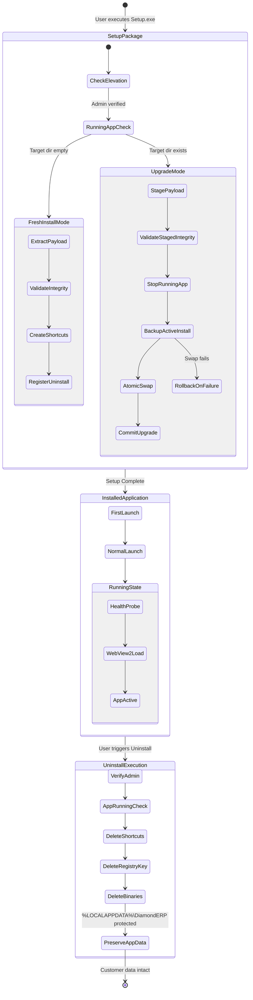

# Diamond ERP V3.0 — Windows Installer & Launcher Lifecycle

> **Phase 1 Audit Artifact**  
> **Repository:** `https://github.com/StavanSheth/Diamond_ERP`  
> **Branch:** `v3`  
> **Source Files:** [`installer/Installer.cs`](file:///c:/Projects/ERP%20-%20Copy/Test/TestV3.0/installer/Installer.cs) and [`installer/Launcher.cs`](file:///c:/Projects/ERP%20-%20Copy/Test/TestV3.0/installer/Launcher.cs)  
> **Audited By:** Senior Software Architect

---

## 1. Lifecycle State Machine & Flow Diagram



---

## 2. Comprehensive Lifecycle Operation Breakdown

### 1. Fresh Installation
- **Trigger:** User launches `DiamondERP-Setup.exe` on a computer where Diamond ERP is not yet installed.
- **Responsible C# Methods in [`installer/Installer.cs`](file:///c:/Projects/ERP%20-%20Copy/Test/TestV3.0/installer/Installer.cs):**
  - `IsAdministrator()` ([Line 1150](file:///c:/Projects/ERP%20-%20Copy/Test/TestV3.0/installer/Installer.cs#L1150)): Checks Windows Principal role `WindowsBuiltInRole.Administrator`.
  - `GetDefaultInstallDir()` ([Line 1162](file:///c:/Projects/ERP%20-%20Copy/Test/TestV3.0/installer/Installer.cs#L1162)): Defaults to `C:\Program Files\DiamondERP`.
  - `PerformInstall(string sourceDir, string targetDir, ...)` ([Lines 1445-1570](file:///c:/Projects/ERP%20-%20Copy/Test/TestV3.0/installer/Installer.cs#L1445-L1570)): Executes installation pipeline.
  - `ExtractRawPayload(...)` ([Lines 1345-1397](file:///c:/Projects/ERP%20-%20Copy/Test/TestV3.0/installer/Installer.cs#L1345-L1397)): Extracts embedded `DiamondERP.Payload.zip` resource stream via `ExtractZipStream`.
  - `ExtractZipStream(...)` ([Lines 1260-1315](file:///c:/Projects/ERP%20-%20Copy/Test/TestV3.0/installer/Installer.cs#L1260-L1315)): Extracts files while enforcing Zip Slip path traversal checks.
  - `VerifyPayloadIntegrity(string dir)` ([Lines 1319-1343](file:///c:/Projects/ERP%20-%20Copy/Test/TestV3.0/installer/Installer.cs#L1319-L1343)): Asserts presence of `DiamondERP.exe`, `runtime/node.exe`, `api/dist/index.js`, `api/prisma/template.db`, and `web/dist/index.html`.
  - `CreateShortcuts(string targetDir)` ([Lines 1700-1760](file:///c:/Projects/ERP%20-%20Copy/Test/TestV3.0/installer/Installer.cs#L1700-L1760)): Creates Desktop and Start Menu `.lnk` shortcuts using Windows Script Host COM (`WshShell`).
  - `RegisterUninstallEntry(string installDir)` ([Lines 1770-1840](file:///c:/Projects/ERP%20-%20Copy/Test/TestV3.0/installer/Installer.cs#L1770-L1840)): Writes Windows Add/Remove Programs registry keys under `HKLM\Software\Microsoft\Windows\CurrentVersion\Uninstall\DiamondERP`.

### 2. First Launch
- **Trigger:** User launches `DiamondERP.exe` immediately following installation.
- **Responsible C# Methods in [`installer/Launcher.cs`](file:///c:/Projects/ERP%20-%20Copy/Test/TestV3.0/installer/Launcher.cs):**
  - `Main(string[] args)` ([Line 88](file:///c:/Projects/ERP%20-%20Copy/Test/TestV3.0/installer/Launcher.cs#L88)): Entry point.
  - `ResolveApplicationDirectory()` ([Line 435](file:///c:/Projects/ERP%20-%20Copy/Test/TestV3.0/installer/Launcher.cs#L435)): Resolves installation base directory.
  - `ResolveDataDirectory()` ([Line 461](file:///c:/Projects/ERP%20-%20Copy/Test/TestV3.0/installer/Launcher.cs#L461)): Resolves `%LOCALAPPDATA%\DiamondERP` and creates directory tree if non-existent.
  - `StartServicesAndNavigate()` ([Line 501](file:///c:/Projects/ERP%20-%20Copy/Test/TestV3.0/installer/Launcher.cs#L501)): Spawns worker thread.
  - `StartBackendProcess()` ([Line 598](file:///c:/Projects/ERP%20-%20Copy/Test/TestV3.0/installer/Launcher.cs#L598)): Spawns `runtime/node.exe api/dist/index.js` with `DIAMOND_DATA_DIR` and port `3002`.
  - `WaitForBackend(string probeUrl, ...)` ([Line 716](file:///c:/Projects/ERP%20-%20Copy/Test/TestV3.0/installer/Launcher.cs#L716)): Polls `http://127.0.0.1:3002/health` while showing WPF splash progress.
  - `InitializeWebView2(string targetUrl)` ([Line 748](file:///c:/Projects/ERP%20-%20Copy/Test/TestV3.0/installer/Launcher.cs#L748)): Configures user data directory to `%LOCALAPPDATA%\DiamondERP\WebView2Data`, attaches navigation handlers, and loads the React application.

### 3. Normal Launch
- **Operation:** Same as first launch, but AppData directory already exists.
- **Single-Instance Mutex:**
  - `Mutex mutex = new Mutex(true, "Global\\DiamondERP_SingleInstance_Mutex", out createdNew)` ([Line 164](file:///c:/Projects/ERP%20-%20Copy/Test/TestV3.0/installer/Launcher.cs#L164)).
  - If `!createdNew`, finds existing window via Win32 `FindWindow(null, WINDOW_TITLE)` and brings it to the foreground with `ShowWindow` + `SetForegroundWindow` ([Lines 168-174](file:///c:/Projects/ERP%20-%20Copy/Test/TestV3.0/installer/Launcher.cs#L168-L174)), then terminates immediately.

### 4. Upgrade
- **Trigger:** Installer detects existing `DiamondERP.exe` in target directory.
- **Execution Path in [`installer/Installer.cs`](file:///c:/Projects/ERP%20-%20Copy/Test/TestV3.0/installer/Installer.cs#L1450-L1538):**
  1. Creates isolated staging folder: `<targetDir>.staging_` ([Line 1451](file:///c:/Projects/ERP%20-%20Copy/Test/TestV3.0/installer/Installer.cs#L1451)).
  2. Extracts new release payload into staging directory ([Line 1455](file:///c:/Projects/ERP%20-%20Copy/Test/TestV3.0/installer/Installer.cs#L1455)).
  3. Verifies extracted staging integrity via `VerifyPayloadIntegrity()` ([Line 1459](file:///c:/Projects/ERP%20-%20Copy/Test/TestV3.0/installer/Installer.cs#L1459)).
  4. Stops running application instances via `EnsureAppNotRunning()` ([Line 1462](file:///c:/Projects/ERP%20-%20Copy/Test/TestV3.0/installer/Installer.cs#L1462)).
  5. Backs up current install directory to `<targetDir>.backup_` via `Directory.Move` ([Line 1475](file:///c:/Projects/ERP%20-%20Copy/Test/TestV3.0/installer/Installer.cs#L1475)).
  6. Moves `<targetDir>.staging_` to `<targetDir>` ([Line 1481](file:///c:/Projects/ERP%20-%20Copy/Test/TestV3.0/installer/Installer.cs#L1481)).
  7. Cleans up `.backup_` directory upon successful swap completion ([Line 1488](file:///c:/Projects/ERP%20-%20Copy/Test/TestV3.0/installer/Installer.cs#L1488)).

### 5. Running-App Upgrade Handling
- **Method:** `EnsureAppNotRunning(bool promptUser, string targetDir)` ([Lines 1580-1650](file:///c:/Projects/ERP%20-%20Copy/Test/TestV3.0/installer/Installer.cs#L1580-L1650)).
- **Sequence:**
  1. Scans running system processes for `DiamondERP` and `node`.
  2. If prompt is enabled, displays dialog: *"Diamond ERP is currently running. Setup must close the application to proceed with installation or upgrade."*
  3. Signals IPC shutdown event `Global\DiamondERP_Shutdown_Event` ([Line 1608](file:///c:/Projects/ERP%20-%20Copy/Test/TestV3.0/installer/Installer.cs#L1608)).
  4. Waits up to 5 seconds for clean exit.
  5. If still running, invokes `p.Kill()` with timeout to release file locks before upgrading binaries.

### 6. Rollback Protection
- **Method:** Exception block in `PerformInstall` ([Lines 1493-1535](file:///c:/Projects/ERP%20-%20Copy/Test/TestV3.0/installer/Installer.cs#L1493-L1535)).
- **Behavior:**
  - If directory swap fails or is interrupted (e.g. anti-virus lock), the installer catches the exception.
  - Automatically restores `<targetDir>.backup_` back to `<targetDir>`.
  - Purges partial staging directory.
  - Leaves the customer's prior working installation fully functional.

### 7. Uninstallation
- **Trigger:** User runs uninstall from Windows Settings or Add/Remove Programs.
- **Method:** `PerformUninstall(string installDir, bool silent)` ([Lines 1857-1975](file:///c:/Projects/ERP%20-%20Copy/Test/TestV3.0/installer/Installer.cs#L1857-L1975)).
- **Sequence:**
  1. Elevation verification (`IsAdministrator()`).
  2. Dialog notification: *"Are you sure you want to uninstall DiamondERP Enterprise Suite? Note: Your local business database records, parcel inventories, and ledgers stored in AppData will be safely preserved."*
  3. Closes running instance via `EnsureAppNotRunning()`.
  4. Deletes Desktop and Start Menu `.lnk` files ([Lines 1894-1906](file:///c:/Projects/ERP%20-%20Copy/Test/TestV3.0/installer/Installer.cs#L1894-L1906)).
  5. Deletes registry uninstall keys from `HKLM` and `HKCU` ([Lines 1909-1921](file:///c:/Projects/ERP%20-%20Copy/Test/TestV3.0/installer/Installer.cs#L1909-L1921)).
  6. Deletes application installation directory (e.g. `C:\Program Files\DiamondERP`) ([Lines 1923-1959](file:///c:/Projects/ERP%20-%20Copy/Test/TestV3.0/installer/Installer.cs#L1923-L1959)).

### 8. Reinstallation & Recovery
- **Operation:** When `Setup.exe` runs on a machine where Diamond ERP was previously uninstalled:
  - Fresh binaries are written to `C:\Program Files\DiamondERP`.
  - The newly installed launcher connects to the existing `%LOCALAPPDATA%\DiamondERP` data directory.
  - All existing databases, ledgers, party master records, and inventory parcels automatically re-attach seamlessly without data loss.

---

## 3. Strict Data Preservation Guarantee (Invariant 7)

```csharp
// Source: installer/Installer.cs, Lines 1924-1930
string localAppData = Environment.GetFolderPath(Environment.SpecialFolder.LocalApplicationData);
string userDbDir = Path.Combine(localAppData, "DiamondERP");
string canonicalInstallDir = Path.GetFullPath(installDir);

if (!canonicalInstallDir.Equals(userDbDir, StringComparison.OrdinalIgnoreCase) &&
    !canonicalInstallDir.StartsWith(userDbDir + Path.DirectorySeparatorChar, StringComparison.OrdinalIgnoreCase))
{
    // Deletes Program Files installation directory only!
    // %LOCALAPPDATA%\DiamondERP is 100% EXCLUDED from deletion.
}
```

### Preservation Summary Table:

| Asset Category | Location | Action During Uninstall | Status Upon Reinstall |
|---|---|---|---|
| Application Binaries | `C:\Program Files\DiamondERP` | **DELETED** | Freshly Reinstalled |
| Desktop / Start Menu Shortcuts | Desktop & Start Menu `.lnk` | **DELETED** | Freshly Recreated |
| Registry Uninstaller Key | `HKLM\Software\...\Uninstall\DiamondERP` | **DELETED** | Freshly Registered |
| SQLite Databases (`*.db`, `*-wal`) | `%LOCALAPPDATA%\DiamondERP\databases` | **STRICTLY PRESERVED** | Immediately Recognized |
| Certificate Uploads | `%LOCALAPPDATA%\DiamondERP\uploads\certs` | **STRICTLY PRESERVED** | Immediately Available |
| Historical Backups | `%LOCALAPPDATA%\DiamondERP\backups` | **STRICTLY PRESERVED** | Retained for Recovery |
| System Configuration | `%LOCALAPPDATA%\DiamondERP\config` | **STRICTLY PRESERVED** | Settings Maintained |
| Application Logs | `%LOCALAPPDATA%\DiamondERP\logs` | **STRICTLY PRESERVED** | Diagnostic Trail Preserved |
