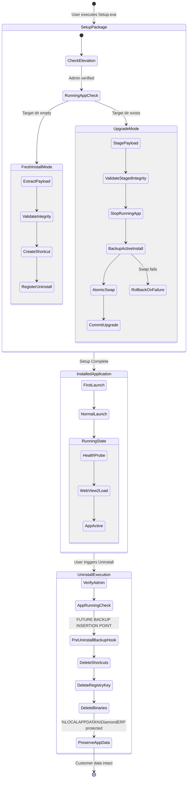

# Diamond ERP V3.0 — Windows Installer, Launcher & Backup Lifecycle

> **Phase 1 Audit Artifact — Code-Level Architecture Mapping**  
> **Repository:** `https://github.com/StavanSheth/Diamond_ERP`  
> **Branch:** `v3`  
> **Authority:** Actual V3 Source Code ([`installer/Installer.cs`](file:///c:/Projects/ERP%20-%20Copy/Test/TestV3.0/installer/Installer.cs), [`installer/Launcher.cs`](file:///c:/Projects/ERP%20-%20Copy/Test/TestV3.0/installer/Launcher.cs), [`apps/api/src/modules/settings/settings.controller.ts`](file:///c:/Projects/ERP%20-%20Copy/Test/TestV3.0/apps/api/src/modules/settings/settings.controller.ts), [`apps/api/src/infrastructure/paths.ts`](file:///c:/Projects/ERP%20-%20Copy/Test/TestV3.0/apps/api/src/infrastructure/paths.ts))  
> **Status:** Remediated Phase 1 Architecture Audit (Confidence $\ge 90\%$)

---

## 1. Lifecycle State Machine & Flow Diagram



---

## 2. Comprehensive Lifecycle Operation Breakdown

### 1. Fresh Installation
- **Trigger:** User launches `DiamondERP-Setup.exe` on a system where Diamond ERP is not installed.
- **Responsible C# Methods in [`installer/Installer.cs`](file:///c:/Projects/ERP%20-%20Copy/Test/TestV3.0/installer/Installer.cs):**
  - `IsAdministrator()` ([Line 1150](file:///c:/Projects/ERP%20-%20Copy/Test/TestV3.0/installer/Installer.cs#L1150)): Asserts Windows Built-in Administrator principal role.
  - `GetDefaultInstallDir()` ([Line 1162](file:///c:/Projects/ERP%20-%20Copy/Test/TestV3.0/installer/Installer.cs#L1162)): Resolves default to `C:\Program Files\DiamondERP`.
  - `PerformInstall(string sourceDir, string targetDir, ...)` ([Lines 1445-1570](file:///c:/Projects/ERP%20-%20Copy/Test/TestV3.0/installer/Installer.cs#L1445-L1570)): Orchestrates the file copy and installation sequence.
  - `ExtractRawPayload(...)` ([Lines 1345-1397](file:///c:/Projects/ERP%20-%20Copy/Test/TestV3.0/installer/Installer.cs#L1345-L1397)): Extracts the embedded `DiamondERP.Payload.zip` resource stream via `ExtractZipStream`.
  - `ExtractZipStream(...)` ([Lines 1260-1315](file:///c:/Projects/ERP%20-%20Copy/Test/TestV3.0/installer/Installer.cs#L1260-L1315)): Extracts files while enforcing Zip Slip path traversal checks.
  - `VerifyPayloadIntegrity(string dir)` ([Lines 1319-1343](file:///c:/Projects/ERP%20-%20Copy/Test/TestV3.0/installer/Installer.cs#L1319-L1343)): Confirms existence of `DiamondERP.exe`, `runtime/node.exe`, `api/dist/index.js`, `api/prisma/template.db`, and `web/dist/index.html`.
  - `CreateShortcut(...)` ([Line 1107](file:///c:/Projects/ERP%20-%20Copy/Test/TestV3.0/installer/Installer.cs#L1107)): Generates Desktop and Start Menu `.lnk` shortcuts using Windows Script Host COM (`shell.CreateShortcut`).
  - `RegisterUninstall(...)` ([Line 1714](file:///c:/Projects/ERP%20-%20Copy/Test/TestV3.0/installer/Installer.cs#L1714)): Writes Windows Add/Remove Programs registry keys under `HKLM\Software\Microsoft\Windows\CurrentVersion\Uninstall\DiamondERP`.

### 2. First Launch
- **Trigger:** User launches `DiamondERP.exe` immediately following installation.
- **Responsible C# Methods in [`installer/Launcher.cs`](file:///c:/Projects/ERP%20-%20Copy/Test/TestV3.0/installer/Launcher.cs):**
  - `Main(string[] args)` ([Line 88](file:///c:/Projects/ERP%20-%20Copy/Test/TestV3.0/installer/Launcher.cs#L88)): Application entry point.
  - `ResolveApplicationDirectory()` ([Line 435](file:///c:/Projects/ERP%20-%20Copy/Test/TestV3.0/installer/Launcher.cs#L435)): Resolves binary location.
  - `ResolveDataDirectory()` ([Line 461](file:///c:/Projects/ERP%20-%20Copy/Test/TestV3.0/installer/Launcher.cs#L461)): Resolves `%LOCALAPPDATA%\DiamondERP` and initializes folder tree (`databases`, `uploads`, `backups`, `logs`, `config`).
  - `StartServicesAndNavigate()` ([Line 501](file:///c:/Projects/ERP%20-%20Copy/Test/TestV3.0/installer/Launcher.cs#L501)): Spawns background worker thread.
  - `StartBackendProcess()` ([Line 598](file:///c:/Projects/ERP%20-%20Copy/Test/TestV3.0/installer/Launcher.cs#L598)): Spawns `runtime/node.exe api/dist/index.js` with `DIAMOND_DATA_DIR` and port `3002`.
  - `WaitForBackend(string probeUrl, ...)` ([Line 716](file:///c:/Projects/ERP%20-%20Copy/Test/TestV3.0/installer/Launcher.cs#L716)): Polls `http://127.0.0.1:3002/health` while rendering WPF splash progress.
  - `InitializeWebView2(string targetUrl)` ([Line 748](file:///c:/Projects/ERP%20-%20Copy/Test/TestV3.0/installer/Launcher.cs#L748)): Configures user data directory to `%LOCALAPPDATA%\DiamondERP\WebView2Data`, attaches event listeners, and loads React application.

### 3. Normal Launch
- **Single-Instance Protection:** Win32 Named Mutex `Global\DiamondERP_SingleInstance_Mutex` ([Line 164](file:///c:/Projects/ERP%20-%20Copy/Test/TestV3.0/installer/Launcher.cs#L164)). If already running, finds existing window via `FindWindow(null, WINDOW_TITLE)` and brings it to foreground with `ShowWindow` + `SetForegroundWindow` ([Lines 168-174](file:///c:/Projects/ERP%20-%20Copy/Test/TestV3.0/installer/Launcher.cs#L168-L174)), then terminates immediately.

### 4. Upgrade & Atomic File Swap
- **Trigger:** Installer detects existing `DiamondERP.exe` in target directory.
- **Execution Path in [`installer/Installer.cs:1450-1538`](file:///c:/Projects/ERP%20-%20Copy/Test/TestV3.0/installer/Installer.cs#L1450-L1538):**
  1. Creates isolated staging folder: `<targetDir>.staging_`.
  2. Extracts new release payload into staging directory.
  3. Validates staging integrity via `VerifyPayloadIntegrity()`.
  4. Stops running application instances via `EnsureAppNotRunning()`.
  5. Backs up current install directory to `<targetDir>.backup_` via `Directory.Move`.
  6. Moves `<targetDir>.staging_` to `<targetDir>`.
  7. Purges `<targetDir>.backup_` upon successful swap completion.

### 5. Running-App Upgrade Handling
- **Method:** `EnsureAppNotRunning(bool promptUser, string targetDir)` ([Lines 1580-1650](file:///c:/Projects/ERP%20-%20Copy/Test/TestV3.0/installer/Installer.cs#L1580-L1650)).
- Signals IPC shutdown event `Global\DiamondERP_Shutdown_Event` ([Line 1608](file:///c:/Projects/ERP%20-%20Copy/Test/TestV3.0/installer/Installer.cs#L1608)), waits 5 seconds for clean exit, and terminates lingering processes with `p.Kill()` if unresponsive.

### 6. Rollback Protection
- Exception block in `PerformInstall` ([Lines 1493-1535](file:///c:/Projects/ERP%20-%20Copy/Test/TestV3.0/installer/Installer.cs#L1493-L1535)): If directory swap fails, automatically restores `<targetDir>.backup_` back to `<targetDir>` and purges partial staging files.

### 7. Uninstallation
- **Method:** `PerformUninstall(string installDir, bool silent)` ([Lines 1857-1975](file:///c:/Projects/ERP%20-%20Copy/Test/TestV3.0/installer/Installer.cs#L1857-L1975)).
- Deletes Desktop and Start Menu `.lnk` files ([Lines 1894-1906](file:///c:/Projects/ERP%20-%20Copy/Test/TestV3.0/installer/Installer.cs#L1894-L1906)).
- Deletes registry uninstall keys from `HKLM` and `HKCU` ([Lines 1909-1921](file:///c:/Projects/ERP%20-%20Copy/Test/TestV3.0/installer/Installer.cs#L1909-L1921)).
- Deletes `C:\Program Files\DiamondERP` binaries only ([Lines 1923-1959](file:///c:/Projects/ERP%20-%20Copy/Test/TestV3.0/installer/Installer.cs#L1923-L1959)).
- **Guarantees that `%LOCALAPPDATA%\DiamondERP` is 100% EXCLUDED from deletion.**

### 8. Reinstallation & Recovery
- When setup runs on a machine where Diamond ERP was previously uninstalled, binaries are restored to Program Files, and the launcher connects to the intact `%LOCALAPPDATA%\DiamondERP` data directory. All existing databases, ledgers, party master records, and inventory parcels automatically re-attach seamlessly without data loss.

---

## 3. Existing Backup & Export Capabilities Audit

| Capability | Exists in Code? | Exact Source File & Line | Implementation Details |
|---|---|---|---|
| **Native SQLite Atomic Backup** | **YES** | [`apps/api/src/modules/settings/settings.controller.ts:1458-1484`](file:///c:/Projects/ERP%20-%20Copy/Test/TestV3.0/apps/api/src/modules/settings/settings.controller.ts#L1458-L1484) | `POST /api/settings/backup` executes `systemPrisma.$executeRawUnsafe("VACUUM INTO '<backupsDir>/diamond_erp_backup_<timestamp>.db'")`. Falls back to `fs.copyFileSync` if unsupported. |
| **Excel Export (.xlsx)** | **YES** | [`apps/api/src/modules/settings/settings.controller.ts:82-84`](file:///c:/Projects/ERP%20-%20Copy/Test/TestV3.0/apps/api/src/modules/settings/settings.controller.ts#L82-L84), [`reports.service.ts:1403`](file:///c:/Projects/ERP%20-%20Copy/Test/TestV3.0/apps/api/src/modules/reports/reports.service.ts#L1403) | `GET /api/settings/export/inventory` uses `ExcelJS.stream.xlsx.WorkbookWriter`. `GET /api/reports/export` streams multi-sheet reports via `workbook.xlsx.write(res)`. |
| **Excel Import (.xlsx)** | **YES** | [`apps/api/src/modules/settings/settings.controller.ts:820-834`](file:///c:/Projects/ERP%20-%20Copy/Test/TestV3.0/apps/api/src/modules/settings/settings.controller.ts#L820-L834) | `POST /api/settings/import/inventory` validates ZIP container header and parses workbook via `workbook.xlsx.load(req.file.buffer)`. |
| **CSV Export / Stringify** | **YES (DEPENDENCY)** | [`apps/api/package.json:24`](file:///c:/Projects/ERP%20-%20Copy/Test/TestV3.0/apps/api/package.json#L24) | `csv-stringify: ^6.8.3` installed in API dependencies. |
| **CSV Parsing** | **YES (DEPENDENCY)** | [`apps/api/package.json:23`](file:///c:/Projects/ERP%20-%20Copy/Test/TestV3.0/apps/api/package.json#L23) | `csv-parse: ^7.0.2` installed in API dependencies. |
| **File Copy / File System** | **YES** | [`apps/api/src/infrastructure/database/prisma.ts:63`](file:///c:/Projects/ERP%20-%20Copy/Test/TestV3.0/apps/api/src/infrastructure/database/prisma.ts#L63) | `fs.copyFileSync`, `fs.mkdirSync`, `fs.statSync` standard Node `node:fs`. |
| **Backup Path Configuration** | **YES** | [`apps/api/src/infrastructure/paths.ts:84-90`](file:///c:/Projects/ERP%20-%20Copy/Test/TestV3.0/apps/api/src/infrastructure/paths.ts#L84-L90) | `getBackupsDir()` checks `process.env.DIAMOND_BACKUPS_DIR` or returns `%LOCALAPPDATA%\DiamondERP\backups`. |
| **Zip Archive Library** | **YES** | [`installer/Installer.cs:23`](file:///c:/Projects/ERP%20-%20Copy/Test/TestV3.0/installer/Installer.cs#L23), [`package.json:23`](file:///c:/Projects/ERP%20-%20Copy/Test/TestV3.0/package.json#L23) | C# `System.IO.Compression.dll` and `System.IO.Compression.FileSystem.dll` for unzipping payload; Node built-in `node:zlib`. |
| **Database Restore API** | **DOES NOT EXIST** | N/A | V3 has zero automated `/api/settings/restore` endpoint. Restoration is currently manual file replacement. |
| **Uninstall Backup Hook** | **DOES NOT EXIST** | N/A | `Installer.cs` preserves AppData, but does not trigger an explicit backup before binary removal. |

---

## 4. Installed Dependencies Audit for Backup & Export

```json
// apps/api/package.json
{
  "dependencies": {
    "@prisma/client": "^5.22.0",    // SQLite query engine & schema
    "exceljs": "^4.4.0",            // Streaming Excel (.xlsx) generation & ingestion
    "csv-parse": "^7.0.2",          // High-performance CSV parser
    "csv-stringify": "^6.8.3",      // CSV serializer with stream support
    "uuid": "^11.1.0",              // Unique identifier generation
    "zod": "^4.5.4"                 // Schema validation
  }
}
```

**Finding:** V3 already possesses all required low-level libraries for Excel, CSV, SQLite VACUUM, and file manipulation. **No new npm packages are required for Phase 7 implementation.**

---

## 5. Actual Database Export Requirements (Prisma Schema Analysis)

When Phase 7 implements full database export and backup, the system must account for the following schema structures from [`schema.prisma`](file:///c:/Projects/ERP%20-%20Copy/Test/TestV3.0/apps/api/prisma/schema.prisma):

1. **Tables to Export:**
   - Operational: `Stock`, `Ledger`, `Party`, `DiamondItem`, `Transaction`, `TransactionItem`, `ItemEvent`, `Certification`, `Repair`, `Location`, `InventoryMovement`, `FinancialEntry`, `ItemTransformation`, `TransformationProvenance`.
   - Governance: `DocumentDraft`, `DraftRevision`, `RecordVersion`, `VersionChange`, `AuditEvent`.
   - Configuration: `Setting`, `Sequence`.
2. **Relational Constraints & Foreign Keys:**
   - Multi-level parent-child relations: `Transaction` $\to$ `TransactionItem` $\to$ `DiamondItem`.
   - Self-referencing hierarchies: `RecordVersion.parentVersionId` $\to$ `RecordVersion.id`.
   - Sequential IDs: `Sequence` table counter must be preserved across export/import.
3. **Sensitive Fields to Sanitize / Exclude:**
   - `User.passwordHash` and `User.pinHash` **MUST NEVER** be exported into unencrypted CSV or Excel files.
   - `Session.tokenHash` must be purged upon export.
4. **Timestamps & UUIDs:**
   - Every table uses ISO 8601 UTC `DateTime` and UUIDv4 strings. Export routines must preserve exact nanosecond/millisecond timestamps to maintain the immutable audit trail.

---

## 6. Uninstall Integration Points for Future Backup & Recovery

In [`installer/Installer.cs:1888-1893`](file:///c:/Projects/ERP%20-%20Copy/Test/TestV3.0/installer/Installer.cs#L1888-L1893), between user confirmation and shortcut deletion:

```csharp
// Source: installer/Installer.cs, PerformUninstall()
if (confirm != DialogResult.Yes)
{
    return;
}

EnsureAppNotRunning(!silent, installDir);

// ── FUTURE INSERTION POINT FOR PHASE 7 PRE-UNINSTALL BACKUP ─────────────
// Trigger backend API or execute SQLite VACUUM INTO against all databases in:
// Path.Combine(Environment.GetFolderPath(Environment.SpecialFolder.LocalApplicationData), "DiamondERP", "databases")
// Write backup archive to:
// Path.Combine(Environment.GetFolderPath(Environment.SpecialFolder.LocalApplicationData), "DiamondERP", "backups")
// Or prompt user for external destination (e.g. USB / Desktop).
// ────────────────────────────────────────────────────────────────────────

try
{
    // 1. Remove Desktop shortcut
    ...
```
